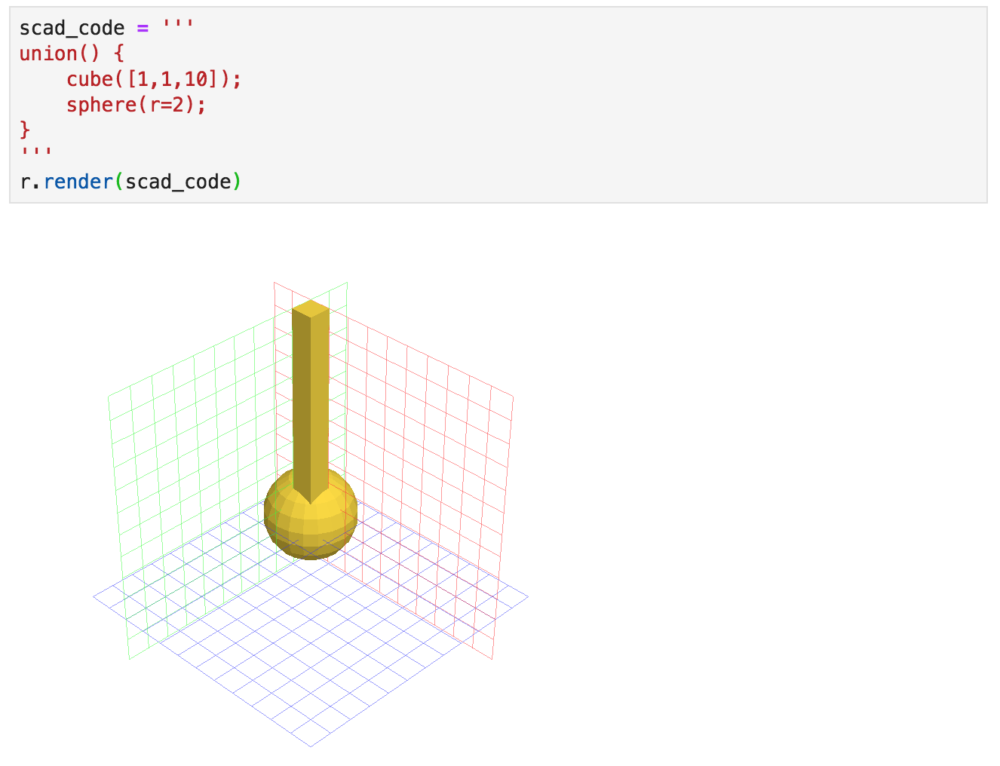

# ViewSCAD: CAD in Jupyter

ViewSCAD is a module that renders within a Jupyter notebook 3D objects described in the [OpenSCAD](https://openscad.org) language, or described using the [SolidPython](https://github.com/SolidCode/SolidPython) module.  It provides a workflow for CAD design completely within the Jupyter notebook.

## Installation
ViewSCAD utilizes the `openscad` executable to render objects, and as such, OpenSCAD must be installed on your system.  

ViewSCAD installs simply with pip:
```
pip install viewscad
```
ViewSCAD uses the `pythreejs` notebook extension to render the 3D graphics.
If you intend to use `jupyter notebook`, you should be all set.  However, if you intend to use `jupyter lab`,  additional steps are necessary to get `pythreejs` working in the lab.  Firstly, you must install [node.js and npm](https://nodejs.org/en/download/).  Then you must install the lab extensions:
```
jupyter labextension install @jupyter-widgets/jupyterlab-manager
```

## Setup and Usage

See the [OpenSCAD](https://openscad.org) and [SolidPython](https://github.com/SolidCode/SolidPython) pages for how to use these languages to represent geometric objects.

The following shows how to use ViewSCAD to render a SolidPython object in Jupyter:


ViewSCAD attempts to locate your openscad executable, based on your platform, but failing that, you can set the `OPENSCAD_EXEC` environment variable to point at your `openscad` command-line executable, or pass it in the constructor of the renderer:
```
renderer = viewscad.Renderer(openscad_exec='path_of_my_openscad')
```

You can also render OpenSCAD code:


The renderer can also create an `.STL` file directly by simply adding an `outfile` keyword:
```
r.render(c, outfile='my_thing.stl')
```

## Acknowledgements

Thanks to Evan Jones for help creating the PyPI package.
